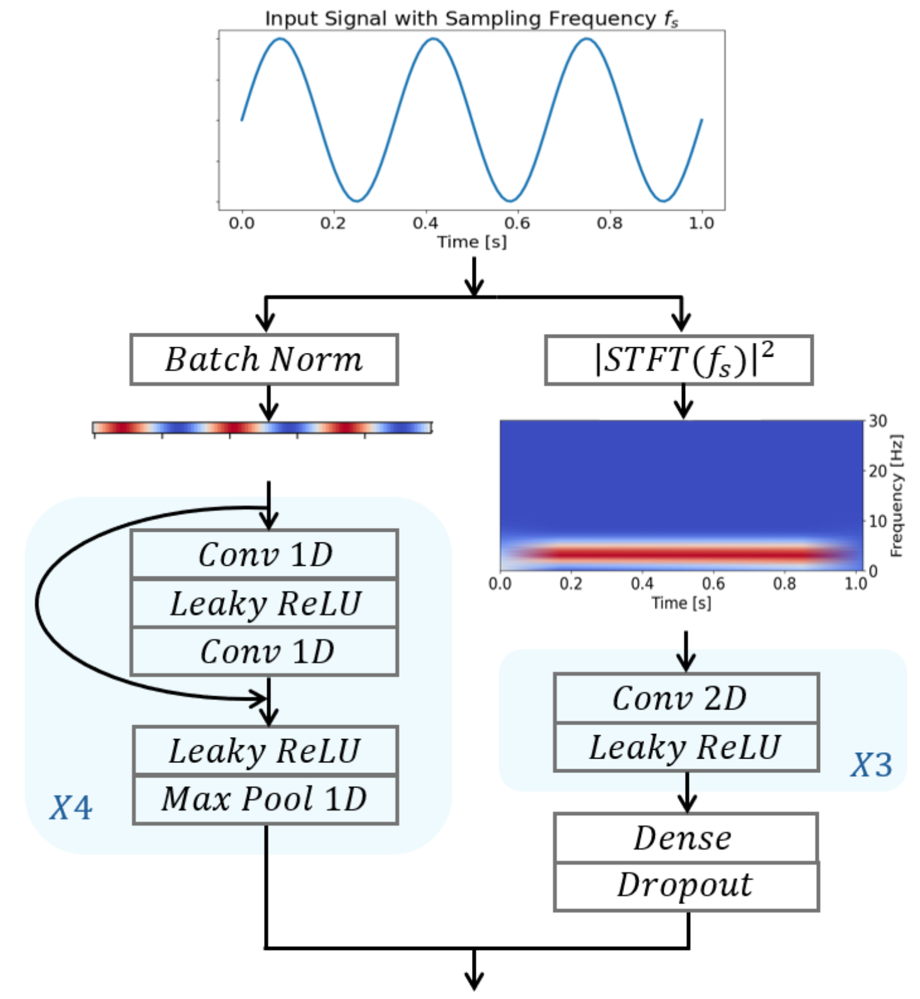
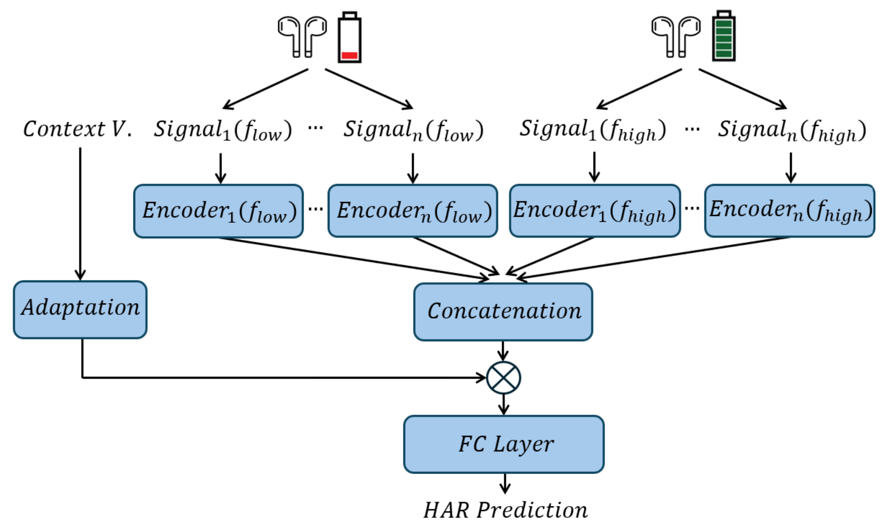
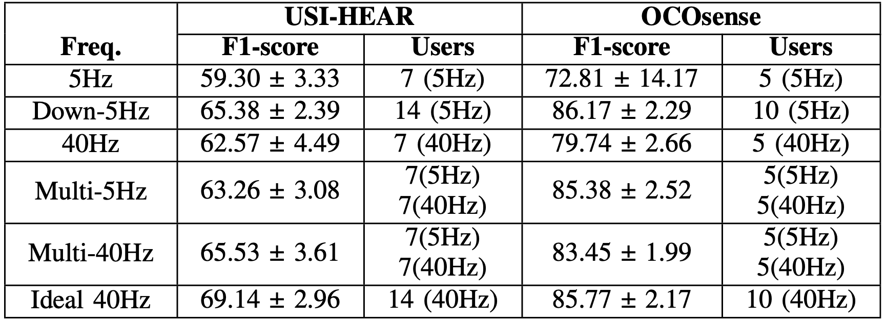

# Multi-Frequency STResNet


## Overview
This repository complements the study ['Multi-frequency Federated Learning for Human Activity Recognition using Head-worn Sensors'](paper/FL_for_HAR_paper.pdf), providing implementation details and results for the Multi-frequency STResNet model (Spectral-Temporal Residual Network). This model uniquely processes signals in both spectral and temporal domains, accommodating different sensor sampling frequencies without necessitating downsampling to a uniform rate.


## Model Architecture




## Datasets
The methodology was validated using two datasets, each involving participants performing seven distinct physical activities:
- **USI-HEAR**: Collected from 30 participants using eSense earbuds, featuring a 6-axis IMU sensor (3-axis accelerometer and gyroscope). The original dataset can be accessed [here](<link-to-USI-HEAR-dataset>).
- **OCOSense**: Gathered from 24 participants via Emteq Labs' OCOSense Smart Glasses, equipped with multiple sensors including a 3-axis accelerometer, gyroscope, magnetometer, and a pressure sensor. The original dataset can be accessed [here](https://www.kaggle.com/datasets/emteqlabs/emteq-ocosense-smart-glasses-har-data?resource=download).

Note: In this repository, we have uploaded two example datasets for demonstration purposes. These are not the ones used in the paper.


## Experimental Results



## Requirements
Required libraries:
- Python: 3.10.12
- Tensorflow: 2.11.1
- Kapre: 0.3.7
- Pandas: 1.5.3
- Numpy: 1.25.1
- Scikit-learn: 1.2.2
- Seaborn: 0.12.2
- Matplotlib: 3.7.2


## Installation
To set up the environment, perform the following steps:
1. Create a conda environment with the required Python version:
    ```
    conda create -n myenv python=3.10.12
    conda activate myenv
    ```
2. Clone this repository to your local machine:
    ```
    git clone https://github.com/dariofenoglio98/Multi_frequency_STResNet.git
    cd Multi_frequency_STResNet
    ```
3. Install the required Python packages:
    ```
    pip install -r requirements.txt
    ```


## Components
The repository includes scripts for each experiment:
- `CL_NHz_training.py`: K-Fold validation for only participants sampled at NHz (3 or 5Hz).
- `CL_40Hz_training.py`: K-Fold validation for only participants sampled at 40Hz.
- `CL_40Hz_all_training.py`: K-Fold validation across all participants at 40Hz.
- `CL_down_NHz_training.py`: K-Fold validation across all participants with downsampling to NHz.
- `CL_multi_freq_training.py`: K-Fold validation across all participants with original sampling frequencies.

## How to Run
Set parameters in `config.py` then execute with: `python [chosen_code].py`.

